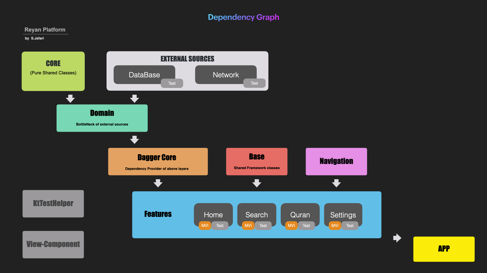

# Reyan
 Reyan is a free modern open-source application based on the latest feature of the Android/IOS development world which'll let you recite the Holy Quran easier than ever!

## Tools And Technolagies
* Programming Language: [Kotlin](https://kotlinlang.org/docs/reference/android-overview.html)
* Architecture: [MVI](http://hannesdorfmann.com/android/model-view-intent)
* MultiThreading: [Coroutines](https://kotlinlang.org/docs/reference/coroutines/coroutines-guide.html)
* Android DI: [Dagger2](https://dagger.dev/users-guide)
* General Networking: [ktor.http](https://ktor.io/clients/http-client/engines.html)
* Android Networking: [OkHttp engine](https://square.github.io/okhttp)
* Testing: [JUnit](https://junit.org/junit5), [Truth](https://truth.dev/), [AndroidX Test](https://developer.android.com/training/testing/set-up-project), [Mockk](https://mockk.io/ANDROID.html)
* Misc: [ExoPlayer](https://exoplayer.dev)
* [Kotlin multi-platform](https://kotlinlang.org/docs/reference/multiplatform.html)

## About
  Reyan means "**Gift of God**" and Reyan applicaton, represents the most valuable gift of God which is the Holy Quran.
  
  Our goal is to make, reading the Holy Quran easier than ever and encourage our user to read more.
  
### Architecture
  Reyan is based on **MVI**. the picture below demonstraits our architecture:
  
  

### Modules
   The architecture is based on different layers, following picture shows the dependency and level of the modules:

    
 
# Contributions
* Bug fixes and Pull Requests are highly appreciated and you're more than welcome to send us your feedbacks

## Installing & Running

 **Download the Reyan source code** 
 
 generate google-service.json and copy it to the root project/app

  generate debugKeystore.jks and copy it to the root project folder
  
  **Create a local.properties in project root folder and add a field for each of the following keys:**

  * debugKeyStoreAddress
  * debugKeyStorePass
  * debugKeyAlias
  * debugKeyPass
  
  **Requirements**
* Android Studio version 4.0 or higher
* Android gradle plugin version 4.0.1
* Gradle version 6.3

License
=======

    Copyright 2020 Islamversity.

    Licensed under the Apache License, Version 2.0 (the "License");
    you may not use this file except in compliance with the License.
    You may obtain a copy of the License at

       http://www.apache.org/licenses/LICENSE-2.0

    Unless required by applicable law or agreed to in writing, software
    distributed under the License is distributed on an "AS IS" BASIS,
    WITHOUT WARRANTIES OR CONDITIONS OF ANY KIND, either express or implied.
    See the License for the specific language governing permissions and
    limitations under the License.
